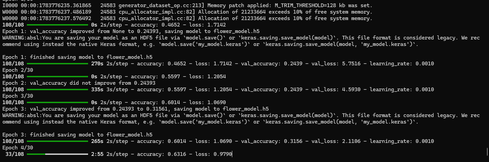
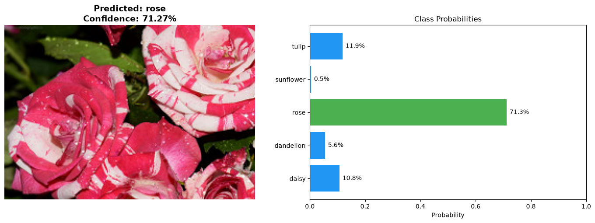
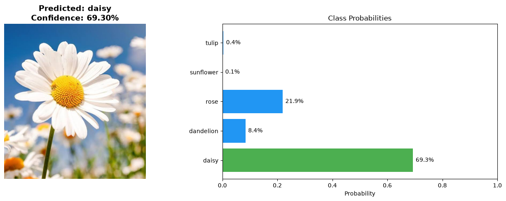

# 🌸 Flower Image Classification with CNN

## Project Description

This project trains a CNN model to recognize and classify 5 different types of flowers:

- 🌼 **Daisy**
- 🌾 **Dandelion**
- 🌹 **Rose**
- 🌻 **Sunflower**
- 🌷 **Tulip**

## Features

- ✅ Reading and preprocessing images
- ✅ Automatic resize of images to standard dimensions
- ✅ Normalize pixel values
- ✅ Data Augmentation to improve model generalization
- ✅ Training of Convolutional Neural Network (CNN)
- ✅ Automatic saving of the best model
- ✅ Early Stopping and Learning Rate Scheduling
- ✅ Drawing accuracy and loss graphs
- ✅ Predicting new images with graphical result display

## Project Structure

```
Image-Classification/
│
├── dataset/
│   ├── train/              # Training data (5 subfolders for each class)
│   │   ├── daisy/
│   │   ├── dandelion/
│   │   ├── rose/
│   │   ├── sunflower/
│   │   └── tulip/
│   └── validation/         # Validation data
│       ├── daisy/
│       ├── ...
│
├── model.py                # CNN model architecture
├── train.py                # Training script
├── predict.py              # Prediction script
├── prepare_dataset.py      # Dataset preparation and splitting
├── requirements.txt        # Dependencies
├── README.md              
└── flower_model.h5         # Saved model (after training)
```

## Technologies Used

- **Python**
- **TensorFlow / Keras** - Deep Learning Framework
- **OpenCV** - Image Processing
- **NumPy** - Numerical Computations
- **Matplotlib** - Plot Visualization

## How to Use

### 1️⃣ Install Dependencies

```bash
pip install -r requirements.txt
```

### 2️⃣ Download and Prepare Dataset

Download the dataset from Kaggle:
🔗 [Flowers Recognition Dataset](https://www.kaggle.com/datasets/alxmamaev/flowers-recognition)

```bash
curl -L -o ~/flowers-recognition.zip\
  https://www.kaggle.com/api/v1/datasets/download/alxmamaev/flowers-recognition
```

After extraction, use the preparation script:

```bash
python prepare_dataset.py --source path/to/flowers --split 0.8
```

This command splits the dataset into train and validation with 80/20 ratio.

### 3️⃣ Train the Model

```bash
python train.py
```
## Train Screenshots




Outputs:
- `flower_model.h5` - Trained model
- `training_history.png` - Accuracy and loss graph
- `class_indices.txt` - Class mapping

### 4️⃣ Predict New Image

```bash
python predict.py path/to/image.jpg
```

Or with options:

```bash
python predict.py rose_sample.jpg --model flower_model.h5
```
 
## Model Architecture

The designed CNN model includes 4 convolutional blocks:

| Layer | Filters | Kernel | Activation |
|-------|---------|--------|-----------|
| Conv2D + BN + MaxPool | 32 | 3×3 | ReLU |
| Conv2D + BN + MaxPool | 64 | 3×3 | ReLU |
| Conv2D + BN + MaxPool | 128 | 3×3 | ReLU |
| Conv2D + BN + MaxPool | 128 | 3×3 | ReLU |
| Flatten + Dropout(0.5) | - | - | - |
| Dense + BN + Dropout(0.3) | 512 | - | ReLU |
| Dense (Output) | 5 | - | Softmax |

**Optimizer:** Adam (lr=0.001)  
**Loss:** Categorical Crossentropy  
**Metrics:** Accuracy

## Results

With default settings and 30 epochs of training, the model usually reaches **80-88%** accuracy on validation data.







⭐ If this project was useful to you, please give it a star!
